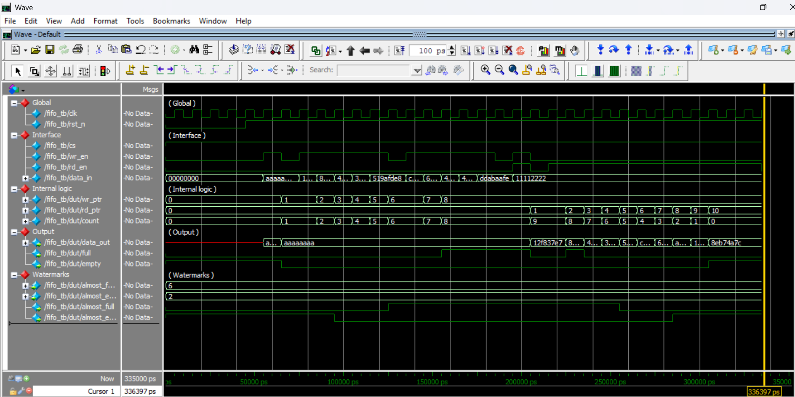
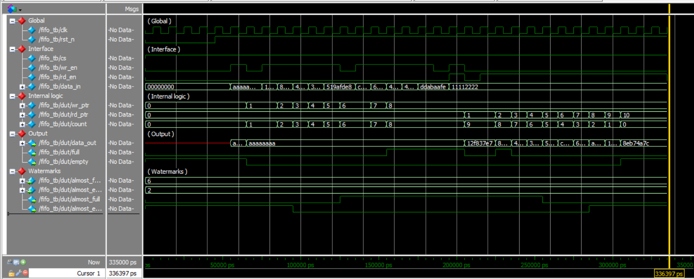
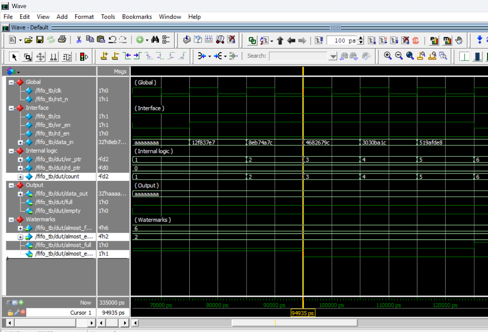

Synchronous FIFO with Zero-Latency Bypass

As an ECE student, I wanted to move past basic "textbook" buffers and build something that solves a real problem: latency. Standard FIFOs usually make you wait for a clock edge to see your data. I designed this one to be faster by adding a Zero-Latency Bypass, making it ideal for high-speed pipelines where every nanosecond matters.

✨ What This FIFO Does

1. Instant Access (Zero-Latency): If the FIFO is empty, your data "jumps" straight to the output without waiting for a clock cycle.

2. Smart Alerts (Watermarks): Instead of just "Full" or "Empty," I added adjustable Almost Full and Almost Empty alerts. This gives the rest of the system a "heads up" before a bottleneck happens.

3. Safe Hardware: I built in "Guards" that automatically ignore writes when the chip is full and reads when it's empty, so your data stays safe from corruption.

4. Efficient Power: The design includes logic to reduce power consumption when the chip is idle.

🧪 How I Verified It

I didn't just write the code—I put it through a "lie detector" test using a Self-Checking Testbench in QuestaSim.
1. The Audit: I used a Reference Model (a perfect software version of the FIFO) to automatically compare every bit that went in against what came out.
2. Randomization: I used random data generation to stress-test the logic and ensure it doesn't crash under unpredictable real-world conditions.
3. Simultaneous Action: I confirmed that reading and writing at the exact same time works perfectly without losing a single bit.

📂 What’s Inside?

fifo_sync_adv.sv/: The core SystemVerilog design logic.
fifo_sync_adv_test.sv/: The self-checking testbench.
run.do/: A Tcl script to run the whole simulation with one click.

🚀 Want to see it run?

If you have QuestaSim or ModelSim:
Open the tool and navigate to the /sim folder.
Type do run.do in the console.
You’ll see the log confirm: --- ALL CONCEPTS & DATA INTEGRITY VERIFIED ---.

### **📊 Simulation Results**

#### **1. Full Verification Overview**

[cite_start]*Complete simulation run demonstrating the sequential flow of data and status flag transitions.* 

#### **2. Zero-Latency Bypass Proof**

[cite_start]*Proof of single-cycle data propagation: `data_out` reflects `data_in` instantly when the FIFO is empty.* 

#### **3. Watermark Assertions**

[cite_start]*Proof of programmable flow control: `almost_full` (Threshold=6) triggering accurately based on internal count. almost_empty (Threshold=2) asserting correctly as the buffer depletes, providing early signaling to the system.*

👨‍💻 About the Author
I'm Shritan Reddy Kasula, a 3rd-year ECE student at VNRVJIET. I’m an aspiring Embedded and VLSI engineer who loves taking different hardware ideas and turning them into working designs. My goal is to eventually contribute to innovative semiconductor development.
