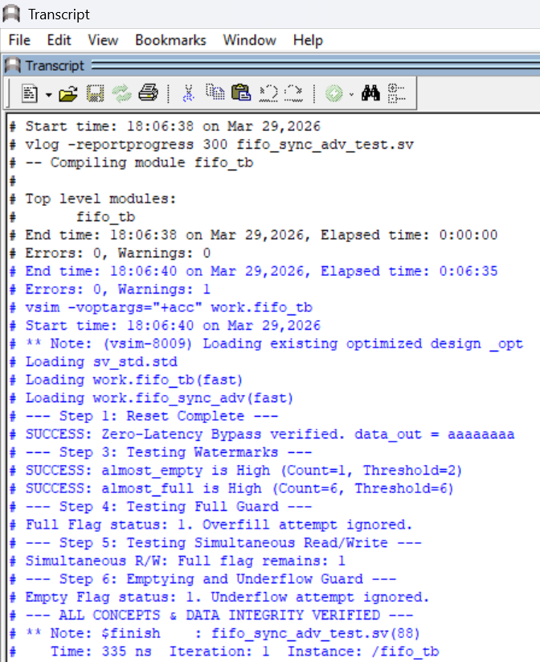
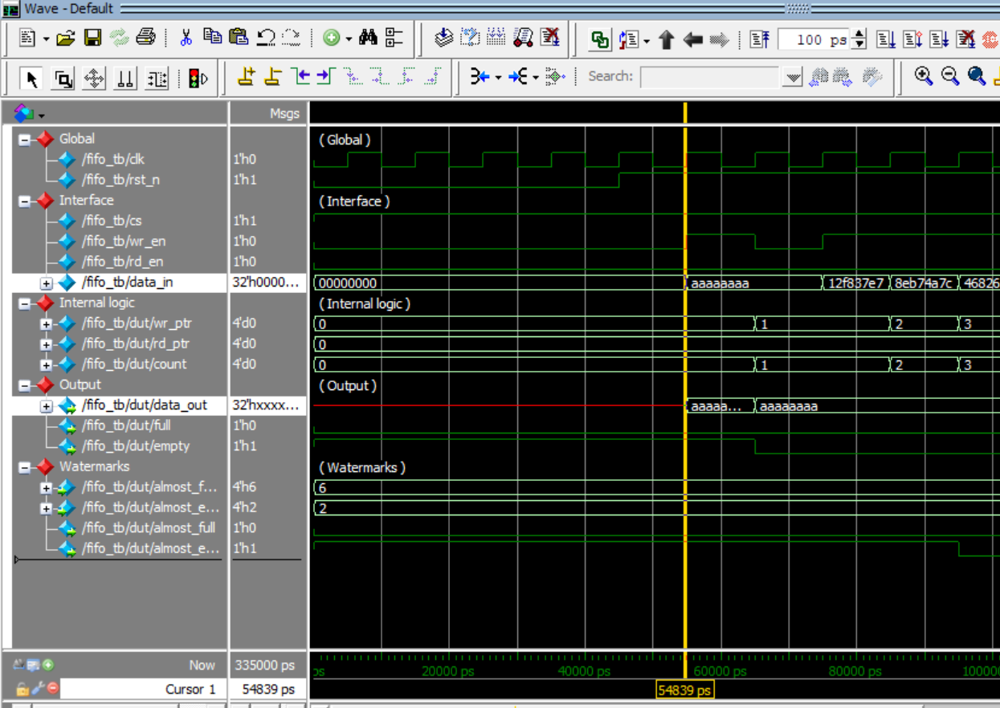
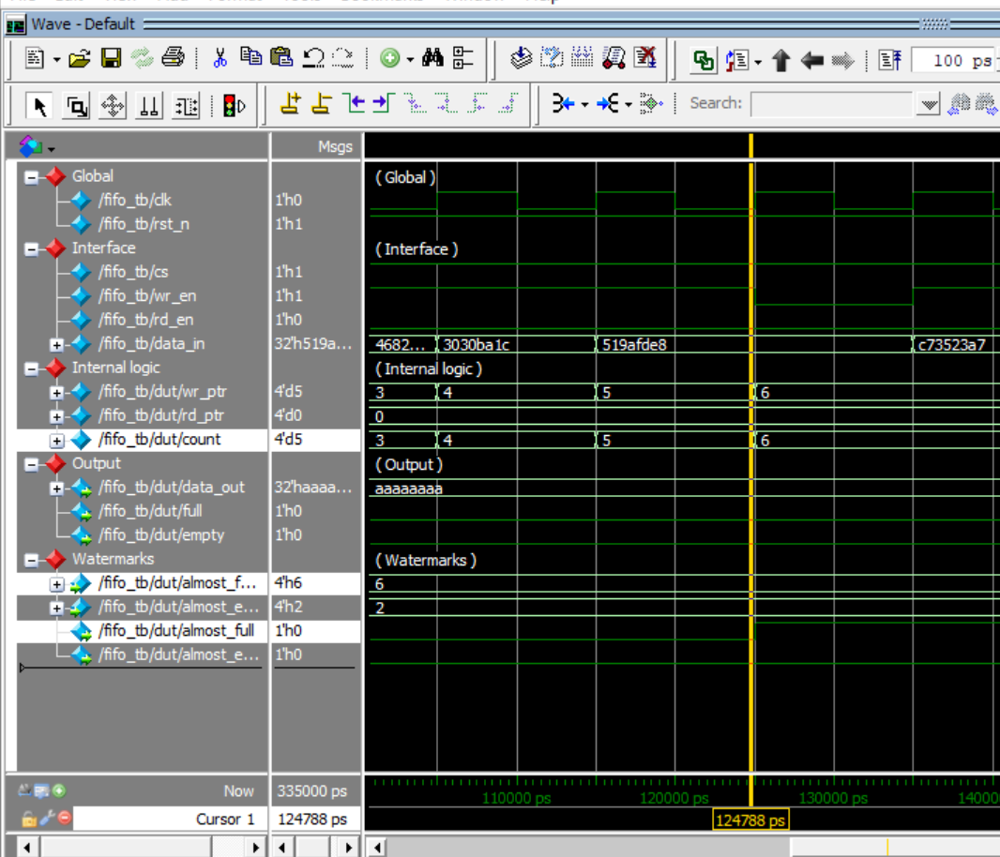

# Synchronous FIFO with Zero-Latency Bypass

# 👋 The "Why" Behind This Project
As an ECE student, I wanted to move past basic "textbook" buffers and build something that solves a real problem: latency. Standard FIFOs usually make you wait for a clock edge to see your data. I designed this one to be faster by adding a **Zero-Latency Bypass**, making it ideal for high-speed pipelines where every nanosecond matters.

# ✨ What This FIFO Does
* **Instant Access (Zero-Latency)**: If the FIFO is empty, your data "jumps" straight to the output without waiting for a clock cycle.
* **Smart Alerts (Watermarks)**: Instead of just "Full" or "Empty," I added adjustable **Almost Full** and **Almost Empty** alerts. This gives the rest of the system a "heads up" before a bottleneck happens.
* **Safe Hardware**: I built in "Guards" that automatically ignore writes when the chip is full and reads when it's empty, so your data stays safe from corruption.
* **Efficient Power**: The design includes logic to reduce power consumption when the chip is idle.

# 🧪 How I Verified It
I didn't just write the code—I put it through a "lie detector" test using a **Self-Checking Testbench** in QuestaSim.
* **The Audit**: I used a **Reference Model** (a software queue) to automatically compare every bit that went in against what came out.
* **Randomization**: I used constrained random data generation to stress-test the logic and ensure it doesn't crash under unpredictable real-world conditions.
* **Simultaneous Action**: I confirmed that reading and writing at the exact same time works perfectly without losing a single bit.

# 📂 What’s Inside?
* **`fifo_sync_adv.sv`**: The core SystemVerilog design logic.
* **`fifo_sync_adv_test.sv`**: The self-checking testbench.
* **`run.do`**: A Tcl script to run the whole simulation with one click.

# 🚀 Want to see it run?
If you have **QuestaSim** or **ModelSim**:
1. Open the tool and navigate to your project folder.
2. Type `do run.do` in the console.
3. You’ll see the log confirm: `--- ALL CONCEPTS & DATA INTEGRITY VERIFIED ---`.

# 📊 Simulation Results

# 1. Verification Transcript (The Final Verdict)

*Automated Verification Log: This transcript confirms that the self-checking testbench passed all 6 critical test steps, finishing with the "ALL CONCEPTS & DATA INTEGRITY VERIFIED" status.*

# 2. Full Verification Overview

*Complete simulation run demonstrating the sequential flow of data, reset, and status flag transitions.*

# 3. Zero-Latency Bypass Proof

*Proof of single-cycle data propagation: `data_out` reflects `data_in` instantly when the FIFO is empty.*

# 4. Watermark Assertions

*Proof of programmable flow control: `almost_full` (Threshold=6) and `almost_empty` (Threshold=2) triggering accurately based on internal count.*

# 👨‍💻 About the Author
I'm **Shritan Reddy Kasula**, a 3rd-year ECE student at VNRVJIET. I’m an aspiring **VLSI engineer** who loves taking hardware ideas and turning them into working designs. My goal is to eventually contribute to innovative semiconductor development.
